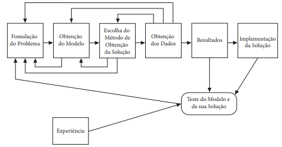

# Fases

1. **Formulação do problema**
    1. Quem tomará decisões?
    2. Quais são são os seus objetivos?
    3. Quais aspectos estão sujeitos ao controle de quem decide (variáveis de decisão) e quais as limitações a que estão sujeitas essas variáveis (restrições)?
    4. Quais os aspectos que estão envolvidos no processo e que fogem ao controle de quem decide?
    5. Uma vez formulada o problema, a etapa seguinte é a construção do modelo.
2. **Construção do Modelo Matemático**

    1. O modelo deve seguir um embasamento cientifico. Um modelo matemático de um problema real é uma representação através de expressões matemáticas que descrevem a essência do problema.
    2. Leva-se em conta a criatividade e conhecimento de negócio, para levantar as variáveis necessárias e fatores decisórios importantes.
    3. O modelo deve permitir a análise do problema modelado, indicando quais são as relações importantes entre as variáveis, quais os dados relevantes, quais são as variáveis de maior importância;
    4. Possibilitar a tentativa de várias alternativas de ação sem interromper o funcionamento do sistema em estudo. 
    5. É a **representação abstrata** de um problema real, usando matemática.
    6. Envolve variáveis, equações, restrições, funções objetivo etc.
    7. Serve para **traduzir a realidade para a linguagem matemática**.
    8. **Não resolve o problema**, apenas o expressa de forma estruturada.

3. **Obtenção da solução**
    1. Programação linear
    2. Álgebra linear
    3. Teoria dos grafos
    4. Teoria das filas
    5. Programação em redes
    6. É o **resultado obtido ao resolver o modelo matemático**.
    7. Mostra **os valores das variáveis** que satisfazem todas as restrições e, se for o caso, otimizam algum objetivo (como maximizar lucro ou minimizar custo).
    8. Representa uma **resposta prática** ao problema real.
4. **Teste do Modelo e da Solução Obtida**

    1. Compreensão do dados.
    2. Verificar a possibilidade de a equipe que irá interpretar os dados interprete de forma errônea.
    3. Definir uma sistemática para testar o modelo.
    4. Refinamento.
    5. Testes contínuos.
    6. Simplificações do modelo.

5. **Implementação**
    1. Passar por um comitê de aprovação.
    2. Documentação do meio de obtenção do resultado e seus recurso (Técnico e fundamentalista) de forma a não suscitar dúvidas.
    3. Preparar equipe que irão interpretar e tomar decisões encima dos resultados.

---

# PL - Programação linear

Um dos problemas mais comuns é o de otimização, quando se procura alocar recursos de forma mais eficiente para obter um resultado x maximizado ou minimizado.

> A Programação Linear (PL) visa fundamentalmente encontrar a melhor solução para problemas que tenham seus modelos representados por expressões
lineares. A sua grande aplicabilidade e simplicidade devem-se a linearidade do
modelo. A tarefa da PL consiste na maximização ou minimização de uma função linear, denominada Função objetivo, respeitando-se um sistema linear de
igualdades ou desigualdades, que recebem o nome de Restrições do Modelo. *“MARINS, Fernando. Introdução à Pesquisa Operacional, São Paulo. 2011”.*
> 

Passos necessários para a resolução de um problema de programação linear (PPL), O primeiro é a Modelagem do problema, seguindo-se o método de solução do modelo.

1. **Modelagem**
    1. Variáveis de decisão
        1. Pergunte “O decisor que tem autoridade para escolher o valor numérico
        (quantidade) do item?” Se a resposta for “sim” esta é uma variável
        de decisão;
        2. Seja bem preciso com respeito às unidades (moeda e quantidade, por
        exemplo) de cada variável de decisão (incluindo o fator tempo, como
        horário, diário, semanal, mensal);
        3. Cuidado para não confundir as variáveis de decisão com os parâmetros
        do problema, como número de máquinas na fábrica, quantidade de
        cada recurso usado na fabricação de um produto, capacidade de produção da fábrica, custos de produção, custos de transporte, demandas
        pelos produtos e assim por diante.
    2. **Função Objetivo**
        1. A função objetivo busca encontrar o melhor que pode ser feito com o que se tem, procura maximizar alguma coisa, tais como lucro ou eficiência, ou minimizar custos. Uma das funções objetivos mais comuns é máximo de lucro total (= retorno - custos). Na PL temos apenas uma função objetivo.
    3. **Restrições**
        1. Crie uma restrição com palavras inicialmente, da seguinte forma,
        (A quantidade requerida de um recurso) <Tem alguma relação com>
        (A disponibilidade do recurso), sendo que essas relações podem ser
        expressas por meio de igualdades (=) ou desigualdades (≥ ou ≤);
        2. Assegure-se que a unidade do termo do lado esquerdo (Left Hand
        Side – LHS) da restrição é a mesma unidade do termo do lado direito
        (Right Hand Side – RHS);
        3. Traduza a restrição em palavras para a notação matemática utilizando
        valores conhecidos ou estimados para os parâmetros e os símbolos matemáticos adotados para as variáveis de decisão;
        4. Reescreva a restrição, se necessário, de modo que os termos envolvendo
        as variáveis de decisão fiquem no lado esquerdo (LHS) da expressão
        matemática, enquanto só o valor associado a uma constante fique no
        lado direito (RHS).

## Exercício 1 de PPL
[Atividade 1](programacao-linear/atividade_1.ipynb)