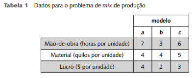

## Mix de produção

Uma Empresa deseja programar a produção de um utensílio de cozinha 
que requer o uso de dois tipos de recursos: mão-de-obra e material. Ela está 
considerando a fabricação de três modelos e o seu Departamento de Engenharia forneceu os dados a seguir (Tabela 1). O suprimento de material é de 
200 quilos por dia. A disponibilidade diária de mão-de–obra é 150 horas. 
Formule um modelo de programação linear para determinar a produção 
diária de cada um dos modelos de modo a maximizar o lucro total da Empresa. 

### Modelagem:

**Variáveis de decisão:**

- \( x_a \) – produção diária do modelo **a**  
- \( x_b \) – produção diária do modelo **b**  
- \( x_c \) – produção diária do modelo **c**  

**Restrições:**

*(limitação de mão-de-obra)*  
\[
7x_a + 3x_b + 6x_c \leq 150
\]

*(limitação de material)*  
\[
4x_a + 4x_b + 5x_c \leq 200
\]

*(não-negatividade)*  
\[
x_a \geq 0, \quad x_b \geq 0, \quad x_c \geq 0
\]

**Função objetivo: maximização do lucro total**

Lucro total:  
\[
L = 4x_a + 2x_b + 3x_c
\]

**Modelo final:**  
Encontrar números \( x_a, x_b, x_c \) tais que:

\[
\text{Max } L = 4x_a + 2x_b + 3x_c
\]

Sujeito às restrições:

\[
\begin{cases}
7x_a + 3x_b + 6x_c \leq 150 \\
4x_a + 4x_b + 5x_c \leq 200 \\
x_a \geq 0,\quad x_b \geq 0,\quad x_c \geq 0
\end{cases}
\]

---

### Generalizando

Suponha que existam \( m \) recursos usados na produção de \( n \) produtos, com os seguintes dados:

- \( c_j \): lucro na venda de uma unidade do produto \( j = 1, 2, \dots, n \)  
- \( b_i \): quantidade disponível do recurso \( i = 1, 2, \dots, m \)  
- \( a_{ij} \): quantidade do recurso \( i \) usada para produzir uma unidade do produto \( j \)  
- \( x_j \): quantidade a produzir do produto \( j \) (variável de decisão)

O modelo geral terá:

**Função objetivo – Max**  
\[
Z = \sum_{j=1}^{n} c_j x_j
\]

**Restrições – sujeito a:**  
\[
\begin{cases}
a_{11}x_1 + \cdots + a_{1n}x_n \leq b_1 \\
a_{21}x_1 + \cdots + a_{2n}x_n \leq b_2 \\
\vdots \\
a_{m1}x_1 + \cdots + a_{mn}x_n \leq b_m \\
x_j \geq 0, \quad j = 1, 2, \dots, n
\end{cases}
\]

---

### Em notação matricial, tem-se:

\[
\text{Max } Z = C'X \quad \text{sujeito a:} \quad
\begin{cases}
AX \leq b \\
X \geq 0
\end{cases}
\]

Onde:

- \( X = \begin{pmatrix} x_1 & x_2 & \cdots & x_n \end{pmatrix}^T \) é o vetor das variáveis de decisão  
- \( C = \begin{pmatrix} c_1 & c_2 & \cdots & c_n \end{pmatrix} \) é o vetor de custos  
- \( b = \begin{pmatrix} b_1 & b_2 & \cdots & b_m \end{pmatrix}^T \) é o vetor das quantidades dos recursos em cada restrição  
- \( A \) é a matriz dos coeficientes tecnológicos:

\[
A = 
\begin{pmatrix}
a_{11} & a_{12} & \cdots & a_{1n} \\
a_{21} & a_{22} & \cdots & a_{2n} \\
\vdots & \vdots & \ddots & \vdots \\
a_{m1} & a_{m2} & \cdots & a_{mn}
\end{pmatrix}
\]
